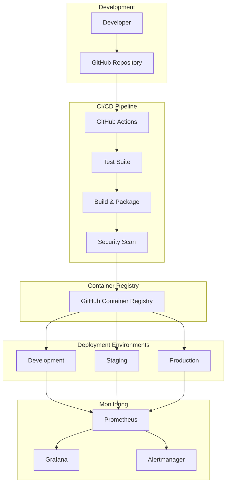

# Bible Daily - 배포 가이드

이 문서는 Bible Daily 프로젝트의 CI/CD 파이프라인과 배포 프로세스에 대한 종합적인 가이드입니다.

## 목차

1. [개요](#개요)
2. [아키텍처](#아키텍처)
3. [환경 구성](#환경-구성)
4. [CI/CD 파이프라인](#cicd-파이프라인)
5. [배포 프로세스](#배포-프로세스)
6. [모니터링 및 로깅](#모니터링-및-로깅)
7. [트러블슈팅](#트러블슈팅)

## 개요

Bible Daily는 GitHub Actions를 사용한 완전 자동화된 CI/CD 파이프라인을 구축하여 개발부터 프로덕션까지 안전하고 효율적인 배포를 지원합니다.

### 주요 특징

- **멀티 환경 지원**: Development, Staging, Production
- **자동화된 테스트**: Unit, Integration, E2E 테스트
- **보안 스캔**: SAST, 의존성 스캔, 컨테이너 스캔
- **무중단 배포**: Rolling Update 전략
- **자동 롤백**: 배포 실패 시 자동 복구
- **모니터링**: Prometheus + Grafana

## 아키텍처

### 전체 아키텍처



### 기술 스택

#### Frontend
- **플랫폼**: Vercel
- **빌드 도구**: Vite
- **배포 전략**: Static Site Generation

#### Backend
- **플랫폼**: Railway / Kubernetes
- **컨테이너**: Docker
- **배포 전략**: Rolling Update

#### 데이터베이스
- **개발/스테이징**: Railway MySQL
- **프로덕션**: AWS RDS MySQL

## 환경 구성

### 1. Development Environment

- **목적**: 개발자 로컬 테스트 및 기능 검증
- **브랜치**: `develop`
- **도메인**: 
  - Frontend: `https://dev.bible-daily.com`
  - Backend: `https://api-dev.bible-daily.com`
- **리소스**: 최소 사양
- **배포**: 자동 (develop 브랜치 푸시 시)

### 2. Staging Environment

- **목적**: 프로덕션 배포 전 최종 검증
- **브랜치**: `main`
- **도메인**:
  - Frontend: `https://staging.bible-daily.com`
  - Backend: `https://api-staging.bible-daily.com`
- **리소스**: 프로덕션과 유사한 환경
- **배포**: 자동 (main 브랜치 푸시 시)

### 3. Production Environment

- **목적**: 실제 서비스 운영
- **브랜치**: `main` (수동 승인 필요)
- **도메인**:
  - Frontend: `https://bible-daily.com`
  - Backend: `https://api.bible-daily.com`
- **리소스**: 고가용성 구성
- **배포**: 수동 승인 후 자동

## CI/CD 파이프라인

### 워크플로우 구성

#### 1. Frontend CI/CD (`frontend-ci-cd.yml`)

```yaml
Trigger: Push/PR to main, develop (frontend/** 경로)
Jobs:
  1. Test & Lint
  2. Build (환경별)
  3. Deploy to Vercel
```

#### 2. Backend CI/CD (`backend-ci-cd.yml`)

```yaml
Trigger: Push/PR to main, develop (backend/** 경로)
Jobs:
  1. Test & Lint
  2. Security Scan
  3. Build Docker Image
  4. Deploy to Railway/K8s
```

#### 3. Test Suite (`test.yml`)

```yaml
Trigger: Push/PR, Scheduled (daily)
Jobs:
  1. Unit Tests
  2. Integration Tests
  3. E2E Tests
  4. Performance Tests
  5. Visual Regression Tests
```

#### 4. Security & Quality (`security-quality.yml`)

```yaml
Trigger: Push/PR, Scheduled (daily)
Jobs:
  1. Code Quality Analysis
  2. Dependency Scan
  3. Container Scan
  4. SAST Scan
  5. Secrets Scan
  6. IaC Scan
```

### 필수 GitHub Secrets

#### 공통 Secrets
```bash
# GitHub Container Registry
GITHUB_TOKEN                    # GitHub 토큰 (자동 생성)

# Vercel (Frontend)
VERCEL_TOKEN                    # Vercel 배포 토큰
VERCEL_ORG_ID                   # Vercel 조직 ID
VERCEL_PROJECT_ID               # Vercel 프로젝트 ID

# Railway (Backend)
RAILWAY_TOKEN                   # Railway 배포 토큰
RAILWAY_PROJECT_ID_DEV          # Railway 개발 프로젝트 ID
RAILWAY_PROJECT_ID_STAGING      # Railway 스테이징 프로젝트 ID
RAILWAY_PROJECT_ID_PROD         # Railway 프로덕션 프로젝트 ID

# 알림
SLACK_WEBHOOK_URL               # Slack 웹훅 URL

# 보안 도구
SONAR_TOKEN                     # SonarCloud 토큰
SNYK_TOKEN                      # Snyk 토큰
SEMGREP_APP_TOKEN              # Semgrep 토큰
LHCI_GITHUB_APP_TOKEN          # Lighthouse CI 토큰
CHROMATIC_PROJECT_TOKEN        # Chromatic 토큰
```

#### 환경별 Secrets (DEVELOPMENT, STAGING, PRODUCTION)
```bash
# Database
DB_HOST_[ENV]                   # 데이터베이스 호스트
DB_PORT_[ENV]                   # 데이터베이스 포트
DB_USERNAME_[ENV]               # 데이터베이스 사용자명
DB_PASSWORD_[ENV]               # 데이터베이스 비밀번호
DB_DATABASE_[ENV]               # 데이터베이스명
DB_ROOT_PASSWORD_[ENV]          # 데이터베이스 루트 비밀번호

# Redis
REDIS_PASSWORD_[ENV]            # Redis 비밀번호

# JWT
JWT_SECRET_[ENV]                # JWT 시크릿 키
JWT_REFRESH_SECRET_[ENV]        # JWT 리프레시 시크릿 키

# Google OAuth
GOOGLE_CLIENT_ID_[ENV]          # Google OAuth 클라이언트 ID
GOOGLE_CLIENT_SECRET_[ENV]      # Google OAuth 클라이언트 시크릿
GOOGLE_CALLBACK_URL_[ENV]       # Google OAuth 콜백 URL

# Firebase
FIREBASE_PROJECT_ID_[ENV]       # Firebase 프로젝트 ID
FIREBASE_PRIVATE_KEY_[ENV]      # Firebase 개인 키
FIREBASE_CLIENT_EMAIL_[ENV]     # Firebase 클라이언트 이메일

# VAPID (Push Notifications)
VAPID_PUBLIC_KEY_[ENV]          # VAPID 공개 키
VAPID_PRIVATE_KEY_[ENV]         # VAPID 개인 키

# Frontend Environment Variables
VITE_API_URL_[ENV]              # API URL
VITE_GOOGLE_CLIENT_ID_[ENV]     # Google 클라이언트 ID
VITE_VAPID_PUBLIC_KEY_[ENV]     # VAPID 공개 키
VITE_FIREBASE_CONFIG_[ENV]      # Firebase 설정 JSON
```

## 배포 프로세스

### 자동 배포 플로우

#### 1. 개발 환경 배포
```bash
1. develop 브랜치에 코드 푸시
2. 자동으로 테스트 실행
3. 테스트 통과 시 빌드 및 배포
4. 배포 완료 알림
```

#### 2. 스테이징 환경 배포
```bash
1. main 브랜치에 코드 푸시 (또는 PR 머지)
2. 자동으로 테스트 및 보안 스캔 실행
3. 통과 시 스테이징 환경에 배포
4. 배포 완료 후 프로덕션 배포 대기
```

#### 3. 프로덕션 환경 배포
```bash
1. 스테이징 배포 성공 후 수동 승인 대기
2. 승인 시 프로덕션 환경에 배포
3. 헬스 체크 및 모니터링
4. 배포 완료 알림
```

### 수동 배포 (Kubernetes)

#### 배포 스크립트 사용
```bash
# 전체 배포
./deployment/scripts/deploy.sh production all

# 백엔드만 배포
./deployment/scripts/deploy.sh production backend

# 롤백
./deployment/scripts/deploy.sh production rollback
```

#### kubectl 직접 사용
```bash
# 네임스페이스 생성
kubectl create namespace production

# 시크릿 배포
kubectl apply -f deployment/secrets/production-secrets.yml -n production

# 애플리케이션 배포
kubectl apply -f deployment/environments/production.yml -n production

# 배포 상태 확인
kubectl rollout status deployment/bible-daily-backend-prod -n production
```

### 롤백 프로세스

#### 자동 롤백
- 헬스 체크 실패 시 자동 롤백
- 배포 타임아웃 시 자동 롤백

#### 수동 롤백
```bash
# GitHub Actions에서 롤백 워크플로우 실행
# 또는 kubectl 사용
kubectl rollout undo deployment/bible-daily-backend-prod -n production
```

## 모니터링 및 로깅

### 메트릭 수집

#### Application Metrics
- **응답 시간**: API 엔드포인트별 응답 시간
- **처리량**: 초당 요청 수 (RPS)
- **에러율**: HTTP 4xx, 5xx 에러 비율
- **활성 사용자**: 동시 접속자 수

#### Infrastructure Metrics
- **CPU 사용률**: 컨테이너별 CPU 사용률
- **메모리 사용률**: 컨테이너별 메모리 사용률
- **디스크 I/O**: 데이터베이스 디스크 사용률
- **네트워크**: 인바운드/아웃바운드 트래픽

#### Business Metrics
- **사용자 등록**: 일일 신규 사용자 수
- **게시물 작성**: 일일 게시물 작성 수
- **미션 완료**: 일일 미션 완료율
- **활성도**: 일일/주간/월간 활성 사용자

### 알림 설정

#### Critical Alerts
- **서비스 다운**: 5분 이상 응답 없음
- **높은 에러율**: 5분간 에러율 10% 초과
- **리소스 부족**: CPU/메모리 사용률 90% 초과

#### Warning Alerts
- **응답 시간 증가**: 평균 응답 시간 2초 초과
- **디스크 공간 부족**: 디스크 사용률 80% 초과
- **보안 취약점**: 새로운 보안 취약점 발견

### 로그 관리

#### 로그 레벨
- **ERROR**: 시스템 오류, 예외 상황
- **WARN**: 경고, 잠재적 문제
- **INFO**: 일반 정보, 주요 이벤트
- **DEBUG**: 디버깅 정보 (개발 환경만)

#### 로그 구조
```json
{
  "timestamp": "2024-01-15T10:30:00.000Z",
  "level": "INFO",
  "service": "backend",
  "environment": "production",
  "userId": "12345",
  "requestId": "req-abc123",
  "message": "User login successful",
  "metadata": {
    "ip": "192.168.1.1",
    "userAgent": "Mozilla/5.0..."
  }
}
```

## 트러블슈팅

### 일반적인 문제들

#### 1. 배포 실패

**증상**: GitHub Actions 워크플로우 실패
```bash
# 로그 확인
gh run list --repo your-org/bible-daily
gh run view [RUN_ID] --log

# 재시도
gh run rerun [RUN_ID]
```

**해결 방법**:
- 시크릿 값 확인
- 의존성 충돌 해결
- 테스트 실패 원인 분석

#### 2. 컨테이너 시작 실패

**증상**: Pod가 CrashLoopBackOff 상태
```bash
# Pod 상태 확인
kubectl get pods -n production

# 로그 확인
kubectl logs -f deployment/bible-daily-backend-prod -n production

# 이벤트 확인
kubectl describe pod [POD_NAME] -n production
```

**해결 방법**:
- 환경 변수 확인
- 리소스 제한 조정
- 헬스 체크 설정 검토

#### 3. 데이터베이스 연결 실패

**증상**: 애플리케이션에서 데이터베이스 연결 불가
```bash
# 데이터베이스 상태 확인
kubectl get pods -l app=mysql -n production

# 연결 테스트
kubectl exec -it [BACKEND_POD] -n production -- npm run db:test
```

**해결 방법**:
- 데이터베이스 서비스 상태 확인
- 네트워크 정책 검토
- 인증 정보 확인

#### 4. 성능 문제

**증상**: 응답 시간 증가, 높은 리소스 사용률
```bash
# 리소스 사용률 확인
kubectl top pods -n production

# HPA 상태 확인
kubectl get hpa -n production
```

**해결 방법**:
- 오토스케일링 설정 조정
- 데이터베이스 쿼리 최적화
- 캐시 전략 검토

### 응급 상황 대응

#### 1. 서비스 완전 중단
```bash
# 즉시 이전 버전으로 롤백
kubectl rollout undo deployment/bible-daily-backend-prod -n production

# 트래픽 차단 (필요시)
kubectl scale deployment bible-daily-backend-prod --replicas=0 -n production
```

#### 2. 데이터베이스 문제
```bash
# 읽기 전용 모드 활성화
kubectl set env deployment/bible-daily-backend-prod DB_READ_ONLY=true -n production

# 백업에서 복구
# (백업 복구 절차는 별도 문서 참조)
```

#### 3. 보안 사고
```bash
# 즉시 서비스 중단
kubectl scale deployment bible-daily-backend-prod --replicas=0 -n production

# 보안 팀 연락
# 로그 보존 및 분석
```

## 추가 리소스

### 문서
- [API 문서](https://api.bible-daily.com/docs)
- [프론트엔드 가이드](./frontend/README.md)
- [백엔드 가이드](./backend/README.md)

### 모니터링 대시보드
- [Grafana 대시보드](https://grafana.bible-daily.com)
- [GitHub Actions](https://github.com/your-org/bible-daily/actions)
- [Vercel 대시보드](https://vercel.com/dashboard)

### 연락처
- **개발팀**: dev@bible-daily.com
- **운영팀**: ops@bible-daily.com
- **보안팀**: security@bible-daily.com

---

이 문서는 지속적으로 업데이트됩니다. 질문이나 개선 사항이 있으면 이슈를 생성해 주세요.
